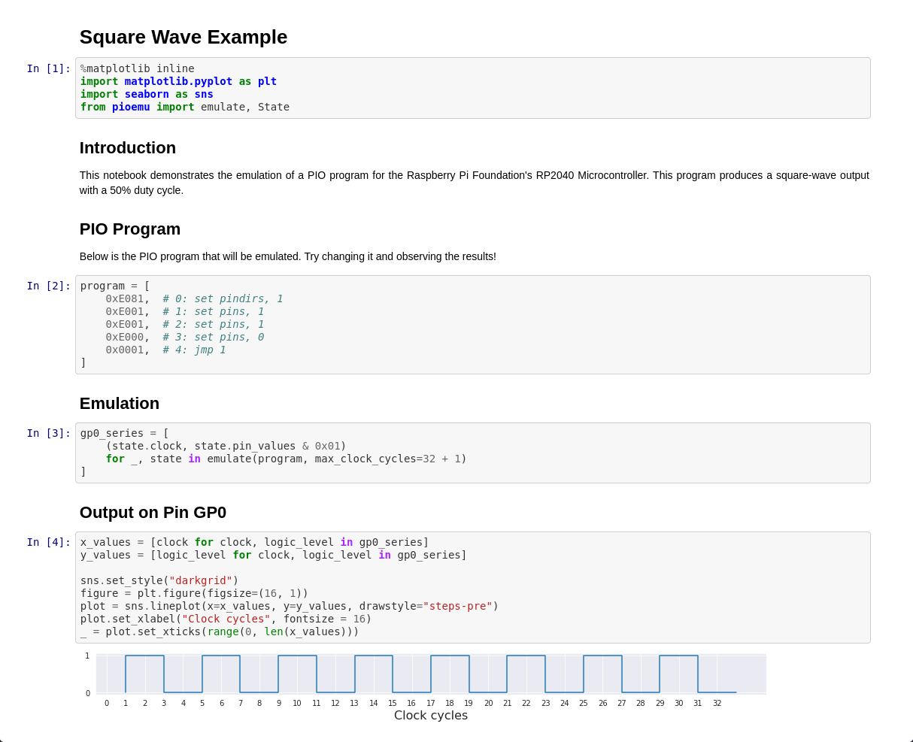

==============================================================================
Emulator for the PIO Blocks within the RP2040 Microcontroller (Python Edition)
==============================================================================

Introduction
============
This repository contains an emulator for the Programmable Input/Output (PIO)
blocks that are present within the Raspberry Pi Foundation's RP2040 Microcontroller.
It is designed to assist in the analysis of PIO programs and to help you by:

* Enabling unit tests to be written.
* Answering questions such as: How many clock cycles are being consumed?
* Supporting the visualization of GPIO outputs over time.
* Providing alternatives to debugging on real hardware, which can be time consuming.

Examples
========

Pimoroni Blinkt! with Unit Test
-------------------------------
An annotated example which demonstrates one approach to writing unit tests for
PIO programs by using an emulator. The PIO program itself is very primitive and
sets all eight LEDs of a Pimoroni Blink! to a single hard-coded colour. Perhaps
you would to like to try re-factoring it? Don't forget to check that the unit-test
still passes!

Jupyter Notebook
----------------
The emulator can also be used from within Jupyter Notebooks. The screenshot below
is taken from the ``examples/jupyter-notebook/square_wave_example.ipynb`` notebook
that is included within this repository.

Limitations
===========
This software is under development and currently has limitations - the notable ones are:

1. Only supports a sub-set of the available instructions:

   * JMP (PIN and !OSRE variants not implemented)
   * MOV (some variants and operations not implemented)
   * OUT (PC, ISR and EXEC destinations not implemented)
   * PULL (IfEmpty not implemented)
   * SET
   * WAIT (IRQ variant not implemented)

2. No support for OUT, SET or IN pin-sets; all pin numbers are with respect to Pin 0.

3. Pin-sets do not wrap after GPIO 31.

4. No direct support for the concurrent running of multiple PIO programs;
   a single State Machine is emulated and not an entire PIO block.
